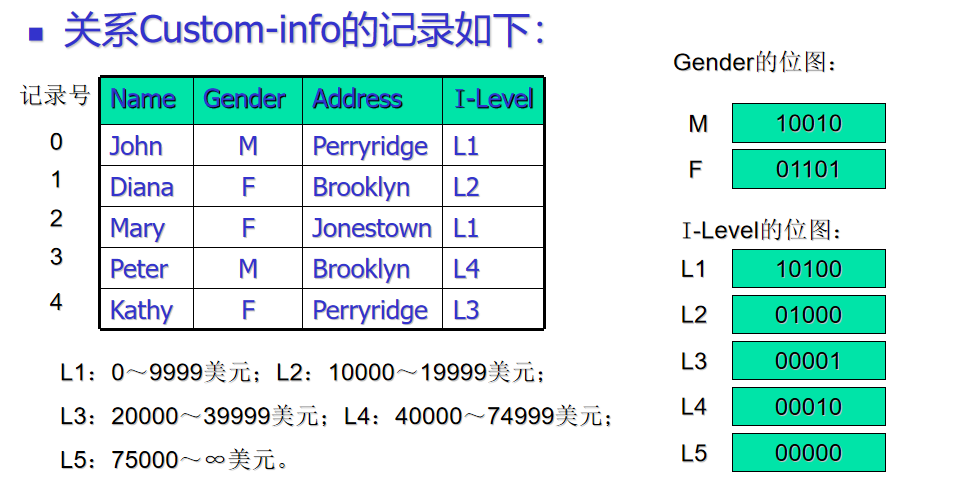

# Bitmap_Index
## 这是一个关于位图索引的实现算法
- 位图就是位的一个简单数组。
- 关系r的属性A上的位图索引是由A能取得的每个值的位图构成的。
- 每个位图都有和关系中的记录数目相等的位。如果第i个记录的字段F的值为v，那么对应于值v的位向量在位置i上的取值为1；否则该向量的位置i上的取值为0。
- 通过位图操作可以很容易地实现多码条件的简单查询。
### 位图索引的诱因
- 位图索引主要在有多个码上的选择时对选择操作有用。

    * 考虑一个选择收入在0～9999之间的女性顾客的查询。在这个例子中，即Gender的位图F=（01101）和I-Level的位图L1＝（10100）的与操作得到位图00100，即第3个记录为要查询的记录。
- 位图的另外一个作用就是可以在不访问关系的条件下由位图索引计算出满足所给条件的元组数。如在本例中找有多少女性的收入水平为L2。
- 和实际关系相比，位图索引通常比较小。在位图中一位就可以代表一个记录。而且位的运算很容易在计算机中实现，执行起来效率比较高。
### 压缩位图
- 假定在一个有n个记录的文件的字段F上建有位图索引，且在文件中出现的字段F不同的值是m。那么该索引的所有位向量的二进制位数就是m×n。
- 随着m的变大，位图索引所需的空间也就越多。但是，如果m很大，那么位向量的1将会很少。所以，我们有机会编码位向量以便它们平均占用的位比n少很多。
- 一个常用的方法叫做分段长度编码。
#### 分段长度编码
- 通过对整数i进行适当的二进制编码，得到一个由i个0且后跟一个1所组成的序列，这个序列表示一个段；
- 把每个段的代码拼接在一起，则得到整个位向量的编码。
- 对整数i的编码方法有多种，但要唯一的确定各个位向量。我们采用的方法如下：
    * 首先需要确定i的二进制表示是多少位。假设数字j为logi的上限，则i可表示为：（j-1个1和单个0）
    * 然后，我们在它的后面加上i的二进制数。
    * 如果i=13，那么j=4。即我们需要4位二进制来表示i。因此i的编码开始部分为1110。再把i的二进制数1101加上，则13的编码为11101101。

####示例    
##### 分段长度编码
- 位向量：100000001000，010000000100
- 分段长度序列（0，7），（1，7）表示从遇到1前面有0个0，7个0
- 0的编码00，7的编码110111，1的编码01
- 编码位向量：00110111，01110111
##### 分段长度解码
- 向前扫描到第一个0并确定j的值。j等于我们找到第一个0所扫描过的位数（在计算位时包括0本身）。
- 一旦知道j，就查找后j位，该j位用二进制表示的数就是i。
- 重复以上过程，直至扫描完整个编码位向量。
##### 分段长度解码
- 编码位向量：11101101001011
- 第四位为0，因而j=4，由下面4位1101得整数13。
- 同理可得分段长度序列（13，0，3）。
- 重新构造实际的位向量：0000000000000110001。

